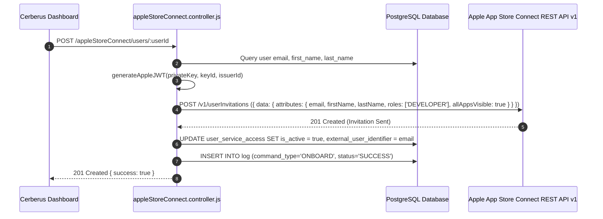
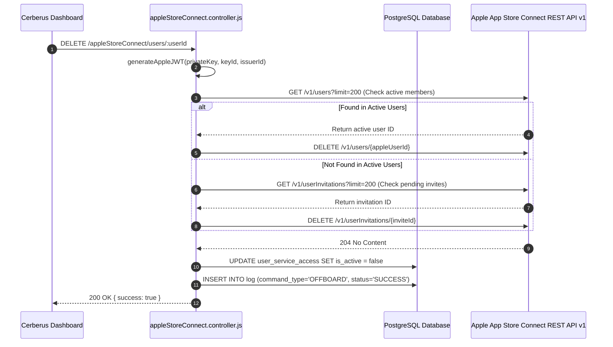

# App Store Connect Integration — Technical Documentation

## 1. Integration Overview
Cerberus manages developer access for **Apple App Store Connect** using the official **App Store Connect REST API v1**. The integration dynamically generates short-lived ES256 JSON Web Tokens (JWT) signed by a `.p8` private key to invite new developers and revoke active team memberships or pending invitations.

---

## 2. Relevant Cerberus Code

| File | Purpose | Important Functions |
| --- | --- | --- |
| `backend/src/controllers/appleStoreConnect.controller.js` | Main controller for Apple REST API calls & ES256 JWT generation | `onboardAppleStoreConnectUser`, `offboardAppleStoreConnectUser`, `generateAppleJWT`, `getApplePrivateKey` |
| `backend/src/routes/appleStoreConnect.routes.js` | Express router mounting Apple endpoints | Router endpoints for `/appleStoreConnect/users/:userId` |
| `frontend/src/App.js` | Frontend orchestrator handling Apple API calls | `onboardAccesses`, `offboardAccesses` |

---

## 3. Authentication / Credentials

### Custom ES256 JWT Generation Lifecycle
`apple_key/*.p8 (Private Key file)` + `APPLE_KEY_ID` + `APPLE_ISSUER_ID` → `generateAppleJWT()` → Signed JWT → `Authorization: Bearer <token>` → `https://api.appstoreconnect.apple.com/v1/`

```javascript
// Header
{ "alg": "ES256", "kid": APPLE_KEY_ID, "typ": "JWT" }

// Payload
{ "iss": APPLE_ISSUER_ID, "iat": now, "exp": now + 1200, "aud": "appstoreconnect-v1" }

// Signature
Node native crypto.createSign("SHA256").sign({ key: privateKeyPem, dsaEncoding: "ieee-p1363" })
```

---

## 4. Required Provider-Side Setup

1. Generate an **App Store Connect API Key** under Users and Access → Keys in App Store Connect.
2. Download the `.p8` key file into `backend/apple_key/`.
3. Configure environment variables in `backend/.env`:
   - `APPLE_KEY_ID`: 10-character Key ID (e.g. `2X9R49U3B2`).
   - `APPLE_ISSUER_ID`: Issuer UUID string (e.g. `69a6de70-0001-47e3-e053-5b8c7c11a4d1`).

---

## 5. Onboarding — Complete Flow



---

## 6. Offboarding — Complete Flow



---

## 7. External API Calls

| Cerberus Function | External API Endpoint | HTTP Method | Purpose | Required Payload |
| --- | --- | --- | --- | --- |
| `onboardAppleStoreConnectUser` | `/v1/userInvitations` | `POST` | Invite new user to team | `{ data: { type: "userInvitations", attributes: { email, firstName, lastName, roles: ["DEVELOPER"], allAppsVisible: true } } }` |
| `offboardAppleStoreConnectUser` | `/v1/users` | `GET` | List active team members | None |
| `offboardAppleStoreConnectUser` | `/v1/userInvitations` | `GET` | List pending invitations | None |
| `offboardAppleStoreConnectUser` | `/v1/users/{id}` or `/v1/userInvitations/{id}` | `DELETE` | Remove user or invite | None |

---

## 8. Request and Response Examples

### User Invitation Request Payload
```json
{
  "data": {
    "type": "userInvitations",
    "attributes": {
      "email": "developer@example.com",
      "firstName": "Jane",
      "lastName": "Doe",
      "roles": [
        "DEVELOPER"
      ],
      "allAppsVisible": true
    }
  }
}
```

---

## 9. Roles and Permissions
- **Default Role Assigned:** `DEVELOPER`.
- **App Access Visibility:** `allAppsVisible: true`.

---

## 10. Important IDs and Configuration

- `APPLE_KEY_ID`: 10-character API Key ID.
- `APPLE_ISSUER_ID`: Issuer UUID from App Store Connect.
- `.p8` File Path: `backend/apple_key/*.p8`.

---

## 11. Error Handling

- **JWT Generation Failure:** Caught in try/catch block, logs failure into PostgreSQL `log` table.
- **Apple API Error Response:** Parses Apple's `errors` array (`title`, `detail`, `code`) and formats concise log string.

---

## 12. Security Considerations

- ES256 signing is performed completely server-side using Node `crypto` module. The `.p8` private signing key is never exposed to the frontend browser client.

---

## 13. Edge Cases

- **User Has Pending Invitation:** Offboarding logic searches both `/v1/users` and `/v1/userInvitations` so pending invitations can be cancelled seamlessly.

---

## 14. Testing the Integration

- Run `POST /appleStoreConnect/users/:userId` with valid `.p8` key placed inside `backend/apple_key/`.

---

## 15. Troubleshooting

- **Error `401 Unauthorized`:** Check that `APPLE_KEY_ID` and `APPLE_ISSUER_ID` match the `.p8` file downloaded from App Store Connect.

---

## 16. Current Limitations

- Apple API limits user list pagination to `limit=200`; for organizations with >200 members, pagination loop can be added.

---

## 17. How to Modify or Extend the Integration

- To assign custom roles (e.g. `ADMIN`, `MARKETING`), edit line 210 in `appleStoreConnect.controller.js`.

---

## 18. End-to-End Summary Flow

```text
Administrator -> Cerberus Dashboard -> POST /appleStoreConnect/users/:userId -> ES256 JWT Signed -> Apple REST API -> Invitation Sent -> Database Updated
```
