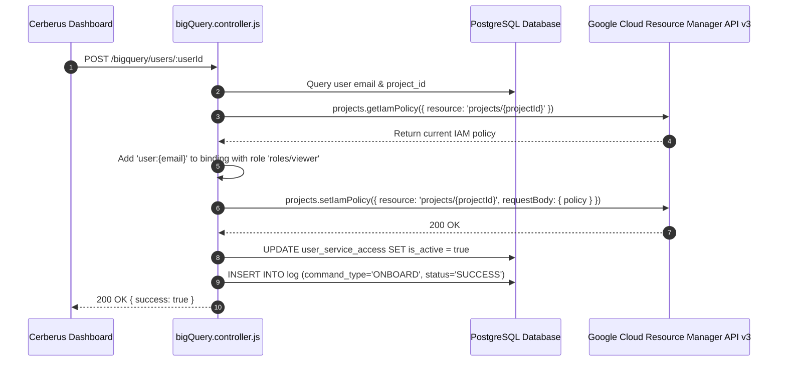
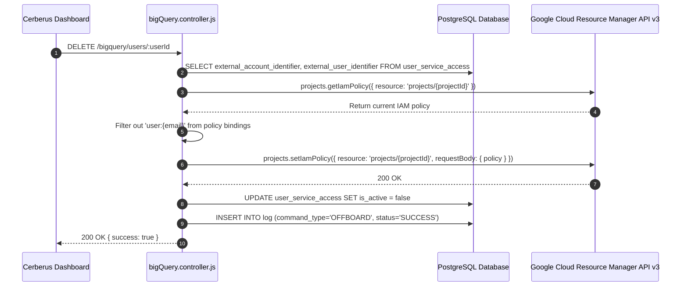

# BigQuery Integration — Technical Documentation

## 1. Integration Overview
Cerberus manages **Google BigQuery** dataset and project access via **Google Cloud Resource Manager API v3**. Provisioning adds user IAM bindings to GCP projects housing BigQuery datasets, and de-provisioning removes IAM bindings during offboarding.

---

## 2. Relevant Cerberus Code

| File | Purpose | Important Functions |
| --- | --- | --- |
| `backend/src/controllers/bigQuery.controller.js` | Main controller for BigQuery IAM policy management | `onboardBigQueryUser`, `removeBigQueryUser`, `getCloudResourceManagerClient`, `getBigQueryProjectId` |
| `backend/src/routes/bigQuery.routes.js` | Express router mounting BigQuery endpoints | Router endpoints for `/bigquery/users/:userId` |
| `frontend/src/App.js` | Frontend orchestrator handling BigQuery API calls | `onboardAccesses`, `offboardAccesses` |

---

## 3. Authentication / Credentials

### Credential Lifecycle
`bigquery_json/*.json (Service Account)` → `getCloudResourceManagerClient()` → `google.auth.GoogleAuth({ keyFile, scopes: ["https://www.googleapis.com/auth/cloud-platform"] })` → `google.cloudresourcemanager({ version: "v3", auth })`

- Service account key is stored in `backend/bigquery_json/`.
- Scoped to `https://www.googleapis.com/auth/cloud-platform`.

---

## 4. Required Provider-Side Setup

1. **Enable Cloud Resource Manager API** in Google Cloud Console.
2. **Grant IAM Admin Role** to the service account on target GCP projects housing BigQuery datasets.

---

## 5. Onboarding — Complete Flow



---

## 6. Offboarding — Complete Flow



---

## 7. External API Calls

| Cerberus Function | External SDK Method | Purpose | Required Data |
| --- | --- | --- | --- |
| `onboardBigQueryUser` | `crm.projects.getIamPolicy` & `setIamPolicy` | Read & append IAM role binding | `resource: projects/{projectId}` |
| `removeBigQueryUser` | `crm.projects.getIamPolicy` & `setIamPolicy` | Read & filter out IAM role binding | `resource: projects/{projectId}` |

---

## 8. Request and Response Examples

### IAM Policy Modification (Set IAM Policy Request)
```json
{
  "policy": {
    "bindings": [
      {
        "role": "roles/viewer",
        "members": [
          "user:john.doe@example.com"
        ]
      }
    ]
  }
}
```

---

## 9. Roles and Permissions
- **Default Onboarding Role:** `roles/viewer` (Grants read access to BigQuery resources in project).
- **Service Account Requirement:** Must possess `roles/resourcemanager.organizationAdmin` or `roles/owner` / `roles/resourcemanager.projectIamAdmin`.

---

## 10. Important IDs and Configuration

- `external_account_identifier`: GCP Project ID.
- `external_user_identifier`: User email address.

---

## 11. Error Handling

- **User Not In Policy:** Returns HTTP 404 with error `User/Role combination not found in IAM policy`.
- **Missing Credentials:** Returns HTTP 500 if `.json` key is missing in `bigquery_json/`.

---

## 12. Security Considerations

- IAM policies use strict filtering before saving back to Google Cloud Resource Manager to prevent overwriting unrelated bindings.

---

## 13. Edge Cases

- If user has multiple IAM roles in the project, passing `role_name` removes only that specific role.

---

## 14. Testing the Integration

- Run `POST /bigquery/users/:userId` against a sandbox GCP project ID configured in `user_service_access`.

---

## 15. Troubleshooting

- **Error 403 `Permission denied on resource`:** Service account lacks IAM Admin privileges on target project.

---

## 16. Current Limitations

- Project-level IAM access is managed; dataset-level fine-grained ACLs are managed via GCP IAM inheritance.

---

## 17. How to Modify or Extend the Integration

- Edit `targetRole = "roles/viewer"` in `bigQuery.controller.js` line 324 to assign custom BigQuery roles (e.g. `roles/bigquery.dataViewer`).

---

## 18. End-to-End Summary Flow

```text
Administrator -> Cerberus Dashboard -> POST /bigquery/users/:userId -> bigQuery.controller.js -> GCP Cloud Resource Manager API -> IAM Policy Updated -> Log Saved
```
