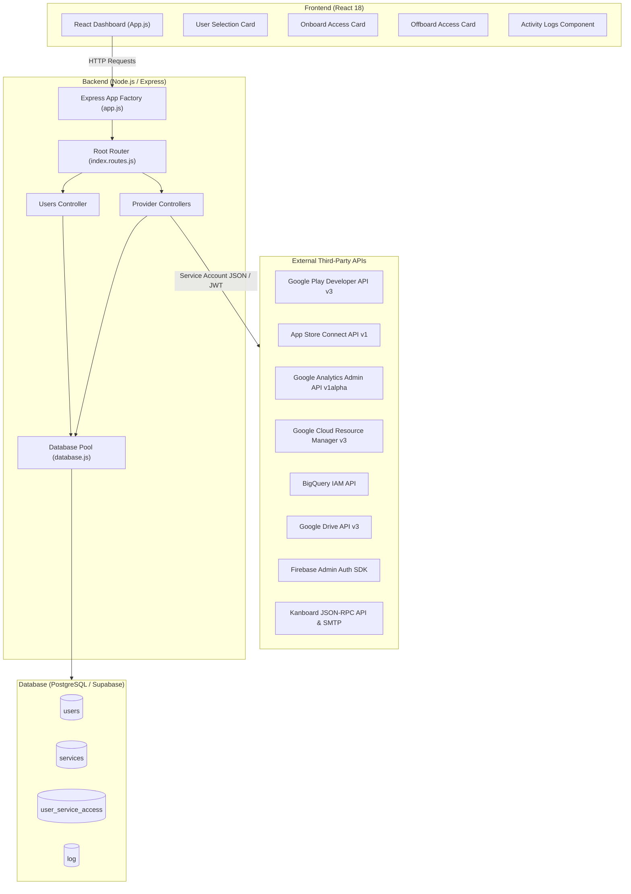
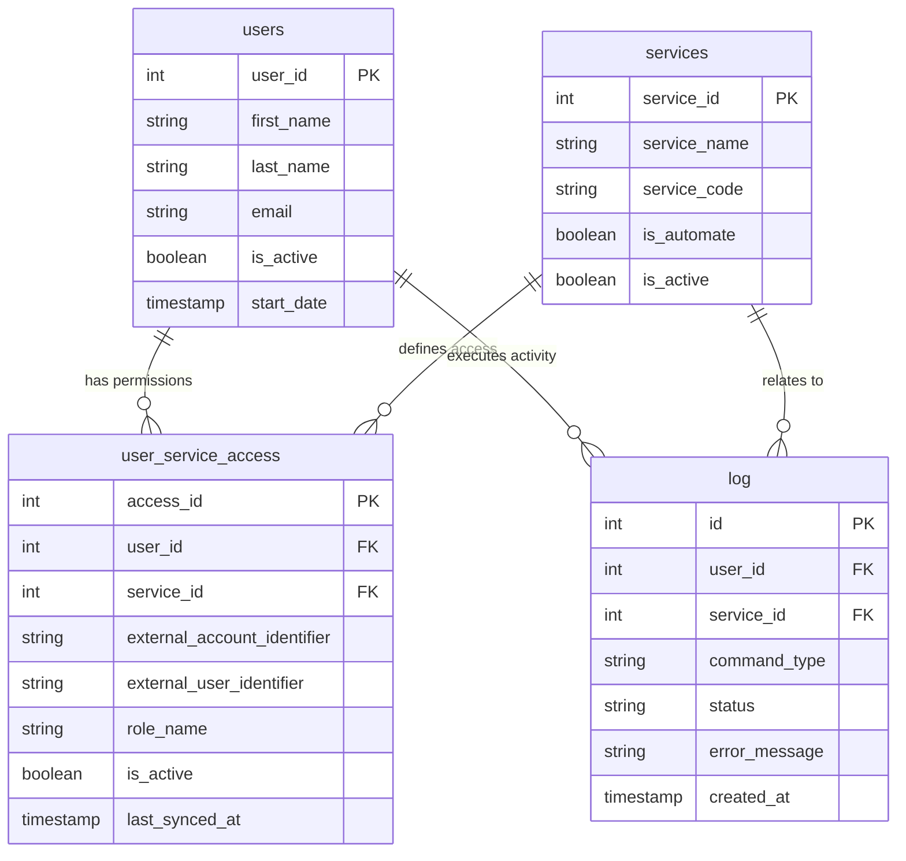
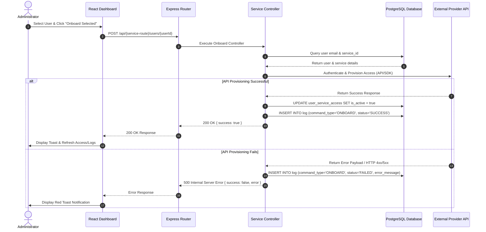
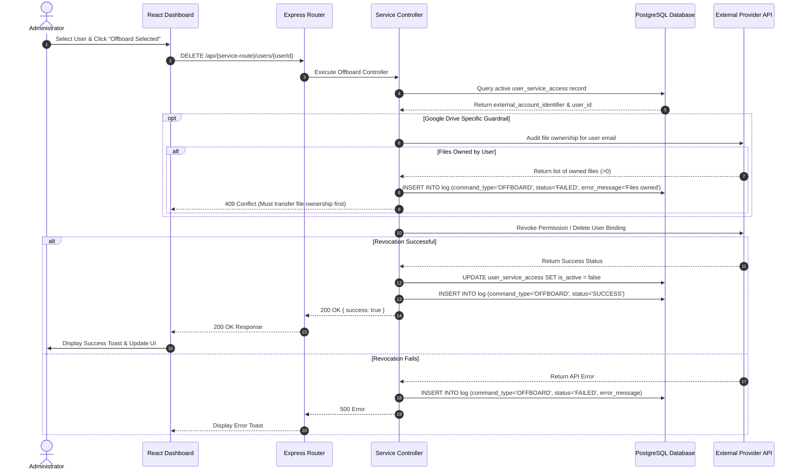

# Cerberus Application: Complete Technical Documentation

> **System Name:** Cerberus (Easley-Dunn Access Management Platform)  
> **Repository:** `easleydunn`  
> **Backend Framework:** Node.js / Express (CommonJS)  
> **Frontend Framework:** React 18 / Tailwind CSS  
> **Database:** PostgreSQL (Supabase / standard pg pool)  

---

## 1. Executive Overview

**Cerberus** is an enterprise access-governance and identity-lifecycle automation system. It centralizes and automates the provisioning (**onboarding**) and de-provisioning (**offboarding**) of user permissions across external cloud platforms, developer portals, data warehouses, analytics platforms, and project management tools.

### The Business Problem Solved
Organizations using multiple developer tools (Google Play Console, App Store Connect, Google Cloud, BigQuery, Google Drive, Google Analytics, Firebase, Kanboard) face administrative overhead and security risks:
- **Manual Overhead:** Provisioning new employees across 8+ different administrative consoles is slow and error-prone.
- **Offboarding Security Risks ("Orphan Accounts"):** When employees leave, administrators often forget to revoke access on one or more external platforms, leaving active backdoors into sensitive cloud infrastructure or IP.
- **Audit Deficits:** Lack of a centralized audit trail recording exactly *when*, *who*, and *whether* access revocation succeeded.

### Cerberus Solution
Cerberus acts as a single pane of glass for access management:
1. **Onboarding in Cerberus:** Selecting an inactive user or unassigned service and executing automated provisioning across selected external platforms.
2. **Offboarding in Cerberus:** Selecting a user and triggering automated revocation across all active third-party platforms with one click, logging every step into a centralized PostgreSQL audit database (`log` table).

### External Systems Managed
- **Google Play Console:** Android App Developer team access.
- **App Store Connect:** iOS App Developer team access.
- **Google Cloud Platform (GCP):** Cloud Project IAM roles.
- **Google BigQuery:** Data Warehouse IAM roles.
- **Google Drive:** Shared folder access & ownership audit checks.
- **Google Analytics (GA4):** Analytics Property & Account access bindings.
- **Firebase:** Authentication identity accounts.
- **Kanboard:** Project membership & user credentials delivery.

---

## 2. System Goals

Based on the actual codebase implementation:
1. **Centralize Access Governance:** Maintain a unified relational database (`users`, `services`, `user_service_access`, `log`) tracking user statuses and platform memberships.
2. **Automated Deprovisioning:** Execute background API calls to revoke credentials, delete members, or remove IAM policy bindings across 8 external provider APIs.
3. **Automated Provisioning:** Invite or create user accounts and attach predefined roles in external APIs upon onboarding requests.
4. **Pre-Offboarding Guardrails:** Audit file ownership in Google Drive before revoking access to prevent data loss or orphan files.
5. **Real-time Audit Trail:** Record every `ONBOARD` and `OFFBOARD` operation result (`SUCCESS` or `FAILED`) with exact timestamp and error payload in PostgreSQL.

---

## 3. Complete Application Architecture

Cerberus follows a decoupled Client-Server architecture:
- **Frontend Layer:** A single-page React 18 application providing interactive cards for onboarding, offboarding, user selection, and real-time activity log audit tables.
- **API Gateway Layer:** Express.js router layer enforcing rate-limiting, CORS, Helmet security headers, request validation, and OpenAPI/Swagger documentation.
- **Service/Controller Layer:** Specialized Node.js controllers managing platform-specific SDKs (`googleapis`, `firebase-admin`, `nodemailer`, custom Apple JWT generator).
- **Persistence Layer:** PostgreSQL database accessed via `pg` connection pool.

### System Architecture Diagram



---

## 4. Repository / Folder Structure

```text
easleydunn/
├── backend/
│   ├── apple_key/                  # Stores Apple Store Connect AuthKey_*.p8 private keys
│   ├── bigquery_json/              # Stores Google BigQuery service account JSON
│   ├── googleanalytics_json/       # Stores Google Analytics Admin service account JSON
│   ├── googlecloud_json/           # Stores Google Cloud Resource Manager service account JSON
│   ├── googledrive_json/           # Stores Google Drive service account JSON
│   ├── googleplay_json/            # Stores Google Play Console service account JSON
│   ├── firebase_json/              # Stores Firebase Admin service account JSON
│   ├── logs/                       # Production log output files (combined.log, error.log)
│   ├── src/
│   │   ├── app.js                  # Express app factory (CORS, RateLimit, Helmet, Swagger)
│   │   ├── config/
│   │   │   ├── app.config.js       # Express server & CORS configuration
│   │   │   ├── db.config.js        # PostgreSQL pool configuration
│   │   │   └── swagger.config.js   # Swagger JSDoc specifications
│   │   ├── controllers/            # 11 Express controllers handling business logic
│   │   ├── db/
│   │   │   └── database.js         # Singleton PostgreSQL pg Pool connection
│   │   ├── middlewares/            # Error handler & 404 router middlewares
│   │   ├── routes/                 # 11 Express router modules
│   │   └── utils/                  # ApiError, asyncHandler wrapper, Winston logger
│   ├── server.js                   # HTTP server entry point & shutdown handlers
│   ├── .env                        # Local environment variables
│   └── package.json                # Dependencies & start scripts
├── frontend/
│   ├── src/
│   │   ├── App.js                  # Main dashboard layout & state orchestrator
│   │   ├── components/             # React UI cards, modals, & tables
│   │   │   ├── ActivityLogsCard.js # Execution activity log table with filters & pagination
│   │   │   ├── ErrorDetailsModal.js# Modal showing dark terminal stack trace & copy button
│   │   │   ├── OnboardAccessCard.js# Grant new permissions card
│   │   │   ├── OffboardAccessCard.js# Revoke active permissions card
│   │   │   ├── UserInfoCard.js     # Selected user avatar & active status header
│   │   │   └── UserList.js         # User list with live search filtering
│   │   └── index.css               # Tailwind CSS & global styles
│   └── package.json                # Frontend dependencies & react-scripts
└── docs/                           # Comprehensive technical documentation suite
```

---

## 5. Application Startup and Initialization

### Backend Startup Trace
1. **Entry Point (`backend/server.js`):**
   - Calls `require("dotenv").config()` to populate `process.env`.
   - Imports `backend/src/app.js` and `backend/src/db/database.js`.
   - Executes `testConnection()` to query PostgreSQL (`SET search_path TO easleydunn`).
   - Listens on `appConfig.port` (default `5001`).
2. **App Factory (`backend/src/app.js`):**
   - Configures Helmet security headers, CORS origins, Express rate-limiting (default 100 req / 15 min), request body parsers (10MB JSON limit), and Morgan HTTP logger.
   - Mounts root router `backend/src/routes/index.routes.js` at `/`.
   - Serves Swagger UI at `/docs`.

### Frontend Startup Trace
1. **Entry Point (`frontend/src/index.js`):**
   - Renders `<App />` from `frontend/src/App.js`.
2. **Main State Setup (`frontend/src/App.js`):**
   - Executes `useEffect()` on mount to fetch `/users` and `/services`.
   - User selection triggers `handleUserSelect(user)`, executing `fetchUserAccesses(userId)` and `fetchUserLogs(userId)`.

---

## 6. Frontend Architecture

The frontend is built using React 18, Tailwind CSS, and Lucide React icons.

### Key Components

| Component | Responsibility | Triggers & API Calls |
| --- | --- | --- |
| `App.js` | Top-level state orchestrator for users, access lists, activity logs, toasts, & modals | Fetches `/users`, `/services`, `/users/:userId/access`, `/users/:userId/logs` |
| `UserList.js` | Displays search-filtered list of active/inactive users | Triggers `onUserSelect(user)` |
| `UserInfoCard.js` | Displays selected user's name, email, avatar initials, and active/inactive status pill | Render-only |
| `OnboardAccessCard.js` | Displays services the user currently lacks access to, divided into Manual and Automate tabs | Triggers `onOnboardAutomateClick` / `onOnboardManualClick` |
| `OffboardAccessCard.js` | Displays active service permissions owned by the selected user | Triggers `onOffboardAutomateClick` / `onOffboardManualClick` |
| `ActivityLogsCard.js` | Displays execution logs for selected user with search, filter pills (`ONBOARD`/`OFFBOARD`, `SUCCESS`/`FAILED`), skeleton shimmer loading rows, and 10-item pagination | Triggers `setSelectedErrorLog(log)` on failed row click |
| `ErrorDetailsModal.js` | Modal displaying dark terminal code block with error stack trace and "Copy Error" action | Copy to clipboard via `navigator.clipboard.writeText` |
| `ConfirmModal.js` | Confirmation popup before executing batch onboarding/offboarding | Triggers `onConfirm()` |

---

## 7. Backend Architecture

Request Flow Pattern:  
`Client Request → Express App (app.js) → Root Router (index.routes.js) → Feature Router (e.g. googlePlay.routes.js) → Async Handler Wrapper (asyncHandler.js) → Controller Function (googlePlay.controller.js) → PostgreSQL Pool Query / Third-Party SDK Call → Response`

### Core Modules
- **Database Connection (`backend/src/db/database.js`):** Exports singleton `getPool()` returning a `pg.Pool` initialized with `DATABASE_URL`.
- **Winston Logger (`backend/src/utils/logger.js`):** Writes colorized console logs in development and JSON log files (`logs/error.log`, `logs/combined.log`) in production.
- **Async Handler (`backend/src/utils/asyncHandler.js`):** Wraps async controller routes to catch unhandled promise rejections and forward them to `errorHandler.middleware.js`.

---

## 8. API Reference Table

Base URL: `http://localhost:5001` (mounted at `/`)

| Method | Endpoint | Purpose | Request Body / Params | Response | Handler |
| --- | --- | --- | --- | --- | --- |
| `GET` | `/health` | Server health check | None | `{ success: true, timestamp, uptime }` | `health.routes.js` |
| `GET` | `/users` | List all users | None | `{ success: true, count, data: [...] }` | `getUsers` |
| `GET` | `/users/:userId/access` | Get active access records | Params: `userId` | `{ success: true, userId, count, data: [...] }` | `getUserAccess` |
| `GET` | `/users/:userId/logs` | Get execution logs & summary | Params: `userId` | `{ success: true, userId, count, summary, data }` | `getUserLogs` |
| `POST` | `/users/:userId/access/:accessId/onboard` | Manually activate access | Params: `userId`, `accessId` | `{ success: true, message }` | `onboardUserAccess` |
| `POST` | `/users/:userId/access/:accessId/offboard` | Manually deactivate access | Params: `userId`, `accessId` | `{ success: true, message }` | `offboardUserAccess` |
| `GET` | `/services` | List all available services | None | `{ success: true, count, data: [...] }` | `getServices` |
| `POST` | `/google-play/users/:userId` | Onboard to Google Play | Params: `userId` | `{ success: true, message, data }` | `onboardGooglePlayUser` |
| `DELETE` | `/google-play/users/:userId` | Offboard from Google Play | Params: `userId` | `{ success: true, message }` | `removeGooglePlayUser` |
| `POST` | `/appleStoreConnect/users/:userId` | Onboard to Apple Store Connect | Params: `userId` | `{ success: true, message, data }` | `onboardAppleStoreConnectUser` |
| `DELETE` | `/appleStoreConnect/users/:userId` | Offboard from App Store Connect | Params: `userId` | `{ success: true, message }` | `offboardAppleStoreConnectUser` |
| `POST` | `/google-cloud/users/:userId` | Onboard to Google Cloud IAM | Params: `userId` | `{ success: true, message, data }` | `onboardGoogleCloudUser` |
| `DELETE` | `/google-cloud/users/:userId` | Offboard from Google Cloud IAM | Params: `userId` | `{ success: true, message }` | `removeGoogleCloudUser` |
| `POST` | `/bigquery/users/:userId` | Onboard to BigQuery IAM | Params: `userId` | `{ success: true, message, data }` | `onboardBigQueryUser` |
| `DELETE` | `/bigquery/users/:userId` | Offboard from BigQuery IAM | Params: `userId` | `{ success: true, message }` | `removeBigQueryUser` |
| `POST` | `/google-drive/users/:userId` | Onboard to Google Drive folders | Params: `userId` | `{ success: true, message, data }` | `onboardGoogleDriveUser` |
| `DELETE` | `/google-drive/users/:userId` | Offboard from Google Drive folders | Params: `userId` | `{ success: true, message, data }` | `offboardGoogleDriveUser` |
| `GET` | `/google-drive/users/:userId/audit` | Audit files owned by user | Params: `userId` | `{ success: true, userEmail, ownedFileCount, data }` | `auditGoogleDriveOwnership` |
| `POST` | `/google-analytics/users/:userId` | Onboard to Google Analytics | Params: `userId` | `{ success: true, message, data }` | `addGoogleAnalyticsUser` |
| `DELETE` | `/google-analytics/users/:userId` | Offboard from Google Analytics | Params: `userId` | `{ success: true, message, bindingName }` | `removeGoogleAnalyticsUser` |
| `POST` | `/firebase/users/:userId` | Onboard to Firebase Auth | Params: `userId` | `{ success: true, message, data }` | `onboardFirebaseUser` |
| `DELETE` | `/firebase/users/:userId` | Offboard from Firebase Auth | Params: `userId` | `{ success: true, message }` | `removeFirebaseUser` |
| `POST` | `/kanboard/users/:userId` | Onboard to Kanboard | Params: `userId` | `{ success: true, message, data }` | `onboardKanboardUser` |
| `DELETE` | `/kanboard/users/:userId` | Offboard from Kanboard | Params: `userId` | `{ success: true, message, data }` | `offboardKanboardUser` |

---

## 9. Authentication and Authorization

### Internal Authentication & Authorization
*Confirmed by Code:* Cerberus currently operates in an administrative console mode. HTTP requests do not require bearer JWT authentication from the browser client. Security is enforced via network isolation, CORS origin restrictions (`CORS_ORIGINS`), and rate-limiting.

### External API Authentication Mechanisms

1. **Google Service Account Credentials (JSON):**
   - Used by Google Play, BigQuery, Google Drive, Google Analytics, Google Cloud, and Firebase controllers.
   - Located in dedicated folders (`googleplay_json/`, `bigquery_json/`, `googledrive_json/`, `googleanalytics_json/`, `googlecloud_json/`, `firebase_json/`).
   - Controllers instantiate `google.auth.GoogleAuth({ keyFile, scopes })` or `firebase-admin/app` `cert()`.

2. **App Store Connect API Key (`.p8`) & Custom ES256 JWT:**
   - Located in `apple_key/` folder (`.p8` private key file).
   - Controller constructs an ES256 JWT signed with Node's native `crypto.createSign("SHA256")` specifying `header: { alg: "ES256", kid: APPLE_KEY_ID }` and `payload: { iss: APPLE_ISSUER_ID, exp: now + 1200, aud: "appstoreconnect-v1" }`.

3. **Kanboard JSON-RPC Basic Auth:**
   - Uses HTTP Basic Authentication (`Authorization: Basic base64(KANBOARD_API_USERNAME:KANBOARD_API_TOKEN)`).

---

## 10. Secret and Credential Management

### Credential Locations & Loading Mechanisms

| Service | Credential Type | Storage Path / Env Var | Accessing Code | Exposure Risk |
| --- | --- | --- | --- | --- |
| Database | PostgreSQL Connection String | `DATABASE_URL` in `.env` | `backend/src/config/db.config.js` | None (Server side only) |
| Google Play | Service Account JSON | `backend/googleplay_json/*.json` | `googlePlay.controller.js` | Low (Gitignored folder) |
| BigQuery | Service Account JSON | `backend/bigquery_json/*.json` | `bigQuery.controller.js` | Low (Gitignored folder) |
| Google Drive | Service Account JSON | `backend/googledrive_json/*.json` | `googleDrive.controller.js` | Low (Gitignored folder) |
| Google Analytics | Service Account JSON | `backend/googleanalytics_json/*.json` | `googleAnalytics.controller.js` | Low (Gitignored folder) |
| Google Cloud | Service Account JSON | `backend/googlecloud_json/*.json` | `googleCloud.controller.js` | Low (Gitignored folder) |
| Firebase | Service Account JSON | `backend/firebase_json/*.json` | `firebase.controller.js` | Low (Gitignored folder) |
| App Store Connect | Private Key (`.p8`), Key ID, Issuer ID | `backend/apple_key/*.p8`, `APPLE_KEY_ID`, `APPLE_ISSUER_ID` | `appleStoreConnect.controller.js` | Low (Gitignored folder) |
| Kanboard | API Token, Username, SMTP Credentials | `KANBOARD_API_TOKEN`, `MAIL_SMTP_PASSWORD` | `kanboard.controller.js` | Low (Server side env) |

*Security Rule Enforced:* Raw credential files and private key contents are strictly ignored by git (`.gitignore`) and never returned over HTTP responses.

---

## 11. Database and Data Models

Cerberus uses PostgreSQL with schema `easleydunn`.

### Entity Relationship Diagram



---

## 12. Complete Onboarding Workflow

### Onboarding Sequence Diagram



---

## 13. Complete Offboarding Workflow

### Offboarding Sequence Diagram



---

## 14. Integration Framework / Design Pattern

Cerberus implements a **Provider-Specific Controller Pattern** with a **Unified Audit Logger**:
1. **Isolated Service Directories:** Each external provider has its dedicated JSON/key folder in `backend/` (`googleplay_json`, `apple_key`, etc.).
2. **Standardized Execution Contract:** Every provider controller implements an onboarding handler (`onboard[Service]User`) and offboarding handler (`remove[Service]User` or `offboard[Service]User`).
3. **Database Logging Contract:** Every operation writes an audit entry into `easleydunn.log` with `user_id`, `service_id`, `command_type` (`ONBOARD`/`OFFBOARD`), `status` (`SUCCESS`/`FAILED`), and `error_message`.

---

## 15. External Software Integrations Overview

- **[Google Play Console Integration](./GOOGLE_PLAY_CONSOLE_INTEGRATION.md)**: Manages developer permissions via `androidpublisher.users`.
- **[BigQuery Integration](./BIGQUERY_INTEGRATION.md)**: Manages project IAM bindings via `cloudresourcemanager.projects`.
- **[Google Drive Integration](./GOOGLE_DRIVE_INTEGRATION.md)**: Manages folder permissions & performs file ownership pre-offboard checks via `drive.permissions` & `drive.files`.
- **[Google Analytics Integration](./GOOGLE_ANALYTICS_INTEGRATION.md)**: Manages GA4 property/account access bindings via Google Analytics Admin API v1alpha.
- **[App Store Connect Integration](./APP_STORE_CONNECT_INTEGRATION.md)**: Manages iOS team invitations & user removals via App Store Connect REST API v1.
- **[Google Cloud IAM Integration](./GOOGLE_CLOUD_INTEGRATION.md)**: Manages GCP project IAM policy bindings via `cloudresourcemanager.projects`.
- **[Firebase Authentication Integration](./FIREBASE_INTEGRATION.md)**: Manages Firebase user identity accounts via `firebase-admin/auth`.
- **[Kanboard Integration](./KANBOARD_INTEGRATION.md)**: Manages project membership via JSON-RPC 2.0 and emails credentials via SMTP.

---

## 16. Error Handling

- **Async Error Catching:** All Express routes wrap controller functions with `asyncHandler.js` to prevent node process crashes.
- **Structured Error Responses:** Errors return uniform JSON payloads `{ success: false, message: string, error?: string }`.
- **Database Logging of Errors:** Provider API failures capture exact HTTP error status codes and API error strings into `log.error_message`.
- **User-Facing Error UI:** The React frontend catches HTTP errors and displays toast alerts and dark terminal modal popups (`ErrorDetailsModal.js`) showing full error text.

---

## 17. Logging and Observability

- **Console & File Logging:** Winston logger writes formatted logs to console and to production log files (`logs/combined.log`, `logs/error.log`).
- **Audit Database Table:** Every administrative action is logged in `easleydunn.log` providing permanent queryable audit records.

---

## 18. Configuration and Environment Variables

| Variable | Used By | Purpose | Required | Sensitive |
| --- | --- | --- | --- | --- |
| `PORT` | `backend/server.js` | HTTP listening port (default `5001`) | No | No |
| `NODE_ENV` | `backend/src/config/app.config.js` | Environment mode (`development`/`production`) | No | No |
| `DATABASE_URL` | `backend/src/config/db.config.js` | PostgreSQL connection URL string | **Yes** | **Yes** |
| `DB_SCHEMA` | `backend/src/config/db.config.js` | PostgreSQL schema name (default `easleydunn`) | No | No |
| `CORS_ORIGINS` | `backend/src/config/app.config.js` | Allowed frontend origins | **Yes** | No |
| `GOOGLE_PLAY_DEVELOPERID` | `googlePlay.controller.js` | Google Play Developer Account ID | **Yes** | No |
| `APPLE_KEY_ID` | `appleStoreConnect.controller.js` | App Store Connect Key ID | **Yes** | No |
| `APPLE_ISSUER_ID` | `appleStoreConnect.controller.js` | App Store Connect Issuer UUID | **Yes** | No |
| `KANBOARD_API_URL` | `kanboard.controller.js` | Kanboard JSON-RPC URL | **Yes** | No |
| `KANBOARD_API_TOKEN` | `kanboard.controller.js` | Kanboard API secret token | **Yes** | **Yes** |
| `MAIL_SMTP_HOSTNAME` | `kanboard.controller.js` | SMTP server host for credentials mail | **Yes** | No |
| `MAIL_SMTP_USERNAME` | `kanboard.controller.js` | SMTP username | **Yes** | No |
| `MAIL_SMTP_PASSWORD` | `kanboard.controller.js` | SMTP password / App password | **Yes** | **Yes** |

---

## 19. Dependencies

### Backend Dependencies (`backend/package.json`)
- `express`: Web application framework.
- `pg`: PostgreSQL client pool library.
- `googleapis`: Official Google APIs Node.js client library.
- `firebase-admin`: Firebase Admin SDK.
- `nodemailer`: SMTP email transport library.
- `swagger-ui-express` & `swagger-jsdoc`: API documentation UI.
- `cors`, `helmet`, `express-rate-limit`: Security & middleware utilities.
- `winston`, `morgan`: Logging libraries.

### Frontend Dependencies (`frontend/package.json`)
- `react`, `react-dom`: UI rendering library.
- `lucide-react`: Icon set.
- `tailwindcss`: Utility-first CSS framework.

---

## 20. Deployment and Runtime

- **Node Version:** Node.js v20 LTS recommended.
- **Frontend Build:** Executed via `npm run build` in `frontend/` generating static bundle in `frontend/build`.
- **Backend Listener:** Executed via `npm start` in `backend/` running `node server.js`.

---

## 21. Security Analysis

- **Current Implementation:** Service account JSON files and `.p8` private keys are loaded from gitignored directories on server disk.
- **Potential Concern:** Standard HTTP endpoints do not currently enforce admin JWT session validation.
- **Recommendation:** Implement admin JWT authentication middleware on all API routes before deploying to public production networks.

---

## 22. How to Add a New Software Integration

To add a new platform integration (e.g. `SLACK`):
1. Create a key directory in `backend/` (e.g., `backend/slack_json/` or add env token `SLACK_BOT_TOKEN`).
2. Create controller `backend/src/controllers/slack.controller.js` implementing `onboardSlackUser` and `offboardSlackUser`.
3. Create route file `backend/src/routes/slack.routes.js` and mount it in `backend/src/routes/index.routes.js`.
4. Insert service row into `services` table (`service_name='Slack', service_code='SLACK', is_automate=true`).
5. Update switch blocks in `frontend/src/App.js` under `onboardAccesses` and `offboardAccesses`.

---

## 23. Testing

- **Backend Integration Testing:** Tests can be executed using `supertest` against `backend/src/app.js`.
- **Frontend Testing:** React component tests can be executed via `npm test` inside `frontend/`.

---

## 24. Troubleshooting Guide

| Issue | Likely Cause | Files to Inspect | Resolution |
| --- | --- | --- | --- |
| `No .json credentials file found` | Missing key file in provider directory | `backend/*_json/` | Place service account JSON file into corresponding folder |
| `APPLE_KEY_ID and APPLE_ISSUER_ID must be configured` | Environment variable missing | `backend/.env` | Add `APPLE_KEY_ID` and `APPLE_ISSUER_ID` to `.env` |
| Google Drive Offboard `409 Conflict` | User still owns files in Drive folder | `googleDrive.controller.js` | Transfer file ownership in Drive before offboarding |
| `ERR_REQUIRE_ESM` on backend start | Incompatible SDK package version | `backend/package.json` | Use `firebase-admin@12` compatible with CommonJS |

---

## 25. Known Limitations / Incomplete Areas

- **Manual Access Endpoints:** `onboardUserAccess` and `offboardUserAccess` update database state but do not call external APIs (used for manual-only services).
- **Kanboard RPC Invites:** Kanboard JSON-RPC does not expose a native invite RPC method; onboarding is implemented via `createUser` + `addProjectUser` + SMTP credential email.

---

## 26. Important Code Map

| Responsibility | File | Main Function / Handler |
| --- | --- | --- |
| Server Bootstrap | `backend/server.js` | Express app listener & shutdown |
| App Setup | `backend/src/app.js` | Middleware configuration |
| Database Pool | `backend/src/db/database.js` | `getPool()` |
| User Activity Logs API | `backend/src/controllers/users.controller.js` | `getUserLogs` |
| Google Play Integration | `backend/src/controllers/googlePlay.controller.js` | `onboardGooglePlayUser`, `removeGooglePlayUser` |
| App Store Connect Integration | `backend/src/controllers/appleStoreConnect.controller.js` | `onboardAppleStoreConnectUser`, `offboardAppleStoreConnectUser` |
| BigQuery Integration | `backend/src/controllers/bigQuery.controller.js` | `onboardBigQueryUser`, `removeBigQueryUser` |
| Google Drive Integration | `backend/src/controllers/googleDrive.controller.js` | `onboardGoogleDriveUser`, `offboardGoogleDriveUser` |
| Google Analytics Integration | `backend/src/controllers/googleAnalytics.controller.js` | `addGoogleAnalyticsUser`, `removeGoogleAnalyticsUser` |
| Google Cloud IAM Integration | `backend/src/controllers/googleCloud.controller.js` | `onboardGoogleCloudUser`, `removeGoogleCloudUser` |
| Firebase Auth Integration | `backend/src/controllers/firebase.controller.js` | `onboardFirebaseUser`, `removeFirebaseUser` |
| Kanboard Integration | `backend/src/controllers/kanboard.controller.js` | `onboardKanboardUser`, `offboardKanboardUser` |
| Frontend Dashboard | `frontend/src/App.js` | `App()` |
| Execution Logs Table | `frontend/src/components/ActivityLogsCard.js` | `ActivityLogsCard()` |
| Error Modal | `frontend/src/components/ErrorDetailsModal.js` | `ErrorDetailsModal()` |

---

## 27. Glossary

- **Cerberus:** The Access Management System.
- **Onboarding:** Granting permissions or creating user accounts in third-party services.
- **Offboarding:** Revoking permissions or deleting user accounts from third-party services.
- **Service Account:** A special Google account used by applications to make authorized API calls.
- **`.p8` File:** Encrypted private key file format used by Apple for App Store Connect API authentication.
- **JWT (JSON Web Token):** Encrypted token used to authenticate requests to App Store Connect API.

---

## 28. New Developer / Maintainer Onboarding Guide

Follow this sequence when starting on Cerberus:
1. Review `docs/README.md` and this master document.
2. Ensure PostgreSQL is accessible and set `DATABASE_URL` in `backend/.env`.
3. Place service account keys into `googleplay_json/`, `apple_key/`, `bigquery_json/`, etc.
4. Run `npm start` in `backend/` and `frontend/`.
5. Open `http://localhost:3000` to interact with the dashboard.

---

## Documentation Coverage Report

| Area | Status | Notes |
| --- | --- | --- |
| Cerberus Architecture | Complete | Documented with Mermaid flowcharts |
| Frontend | Complete | All React components covered |
| Backend | Complete | All controllers and routes covered |
| Authentication | Complete | Service accounts, JWT, and basic auth documented |
| Onboarding | Complete | Documented with sequence diagram |
| Offboarding | Complete | Documented with sequence diagram |
| Google Play Console | Complete | Covered in master & dedicated doc |
| BigQuery | Complete | Covered in master & dedicated doc |
| Google Drive | Complete | Covered in master & dedicated doc |
| Google Analytics | Complete | Covered in master & dedicated doc |
| App Store Connect | Complete | Covered in master & dedicated doc |
| Google Cloud IAM | Complete | Covered in master & dedicated doc |
| Firebase Auth | Complete | Covered in master & dedicated doc |
| Kanboard | Complete | Covered in master & dedicated doc |
