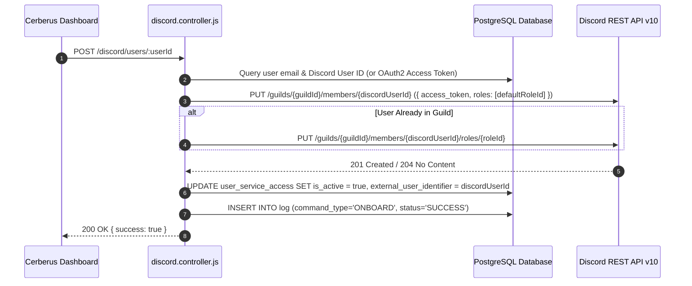
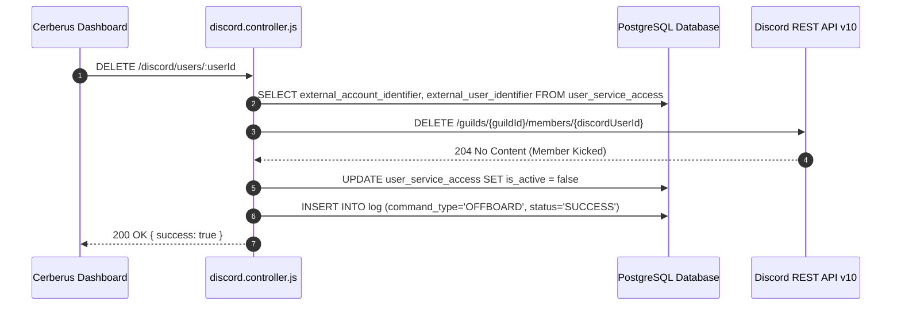

# Discord Integration — Technical Documentation

## 1. Integration Overview
Cerberus integrates with **Discord** using the **Discord REST API v10** (via Bot Token Authorization). The integration automates community and team access management by adding users to a Discord Server (Guild), granting guild roles (e.g. Developer, Contributor, Staff) during onboarding, and kicking or removing guild memberships during offboarding.

---

## 2. Relevant Cerberus Code

| File | Purpose | Important Functions |
| --- | --- | --- |
| `backend/src/controllers/discord.controller.js` | Main controller for Discord REST API interactions (Guild Member management) | `onboardDiscordUser`, `removeDiscordUser`, `getDiscordClient` |
| `backend/src/routes/discord.routes.js` | Express router mounting Discord endpoints | Router endpoints for `/discord/users/:userId` |
| `frontend/src/App.js` | Frontend orchestrator handling Discord onboarding/offboarding API requests | `onboardAccesses`, `offboardAccesses` |

---

## 3. Authentication / Credentials

### Credential Lifecycle
`DISCORD_BOT_TOKEN` in `.env` → `getDiscordClient()` → `Authorization: Bot <DISCORD_BOT_TOKEN>` → `https://discord.com/api/v10/`

1. The bot token is generated in the Discord Developer Portal under Bot settings.
2. Cerberus attaches the header `Authorization: Bot ${process.env.DISCORD_BOT_TOKEN}` to all HTTP requests sent to Discord's API.

---

## 4. Required Provider-Side Setup

1. **Create Discord Application & Bot** in the [Discord Developer Portal](https://discord.com/developers/applications).
2. **Enable Privileged Gateway Intents:** Enable **Server Members Intent** (`GUILD_MEMBERS`).
3. **Invite Bot to Guild:** Generate an OAuth2 URL with scope `bot` and permissions `Manage Roles` (0x10000000) and `Kick Members` (0x00000002).
4. **Environment Variables in `backend/.env`:**
   - `DISCORD_BOT_TOKEN`: Discord Bot Token.
   - `DISCORD_GUILD_ID`: Target Discord Server ID (e.g. `123456789012345678`).
   - `DISCORD_DEFAULT_ROLE_ID`: Default Role ID to assign upon onboarding.

---

## 5. Onboarding — Complete Flow



---

## 6. Offboarding — Complete Flow



---

## 7. External API Calls

| Cerberus Function | External Endpoint | HTTP Method | Purpose | Required Data |
| --- | --- | --- | --- | --- |
| `onboardDiscordUser` | `/guilds/{guildId}/members/{userId}` | `PUT` | Add user to Guild or assign initial roles | `access_token`, `roles: [roleId]` |
| `onboardDiscordUser` | `/guilds/{guildId}/members/{userId}/roles/{roleId}` | `PUT` | Add specific role to Guild Member | `guildId`, `userId`, `roleId` |
| `removeDiscordUser` | `/guilds/{guildId}/members/{userId}` | `DELETE` | Kick member from Guild (Offboard) | `guildId`, `userId` |

---

## 8. Request and Response Examples

### Add Guild Member Request Payload
```json
{
  "access_token": "USER_OAUTH2_ACCESS_TOKEN",
  "nick": "John Doe",
  "roles": [
    "987654321098765432"
  ],
  "mute": false,
  "deaf": false
}
```

---

## 9. Roles and Permissions
- **Default Assigned Role:** Extracted from `DISCORD_DEFAULT_ROLE_ID` or custom `role_name` in `user_service_access`.
- **Bot Permissions Required:** `MANAGE_ROLES` and `KICK_MEMBERS`. Bot role must be higher in the Discord Server Role Hierarchy than the assigned role.

---

## 10. Important IDs and Configuration

- `DISCORD_GUILD_ID`: Target Discord Server Guild ID.
- `external_account_identifier`: Stores Guild ID.
- `external_user_identifier`: Stores Discord Snowflake User ID (e.g. `234567890123456789`).

---

## 11. Error Handling

- **Missing Bot Token:** Throws HTTP 500 if `DISCORD_BOT_TOKEN` is missing in `.env`.
- **Higher Hierarchy Role Error (403 Forbidden):** Returns HTTP 500 with error log detailing role hierarchy conflict.

---

## 12. Security Considerations

- Bot Token grants administrative privileges over Discord Guild members; must be kept strictly inside `backend/.env`.

---

## 13. Edge Cases

- **User Not in Guild:** If `DELETE /guilds/{guildId}/members/{userId}` returns HTTP 404, Cerberus marks database access record inactive and logs success (user already left server).

---

## 14. Testing the Integration

- Run `POST /discord/users/:userId` with test Guild ID and Bot Token configured in `backend/.env`.

---

## 15. Troubleshooting

- **Error `403 Missing Permissions`:** Verify that the Bot has `Manage Roles` permission and its bot role is positioned above the assigned role in Server Settings → Roles.

---

## 16. Current Limitations

- Adding new users directly to a Discord Guild requires a Discord OAuth2 user access token with `guilds.join` scope.

---

## 17. How to Modify or Extend the Integration

- To send a welcome Direct Message (DM) to onboarded users, call `POST /users/@me/channels` followed by `POST /channels/{channel_id}/messages`.

---

## 18. End-to-End Summary Flow

```text
Administrator -> Cerberus Dashboard -> POST /discord/users/:userId -> discord.controller.js -> Discord REST API -> Member Added/Kicked -> Log Recorded
```
