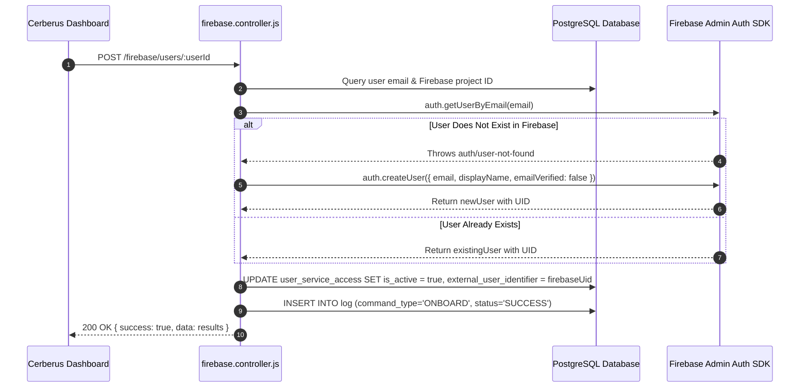
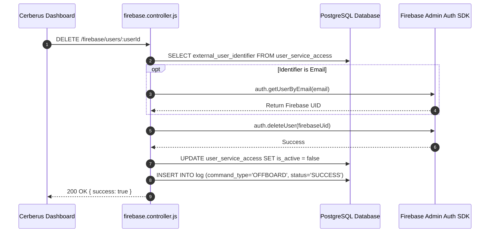

# Firebase Authentication Integration — Technical Documentation

## 1. Integration Overview
Cerberus integrates with **Firebase Authentication** using the official **Firebase Admin SDK (`firebase-admin/auth`)**. The integration manages user identity accounts across Firebase projects by looking up existing users, creating user accounts during onboarding, and deleting accounts during offboarding.

---

## 2. Relevant Cerberus Code

| File | Purpose | Important Functions |
| --- | --- | --- |
| `backend/src/controllers/firebase.controller.js` | Main controller for Firebase Admin Auth SDK initialization and user creation/deletion | `onboardFirebaseUser`, `removeFirebaseUser`, `getFirebaseAuth`, `getFirebaseProjectId` |
| `backend/src/routes/firebase.routes.js` | Express router mounting Firebase endpoints | Router endpoints for `/firebase/users/:userId` |
| `frontend/src/App.js` | Frontend orchestrator handling Firebase API calls | `onboardAccesses`, `offboardAccesses` |

---

## 3. Authentication / Credentials

### Credential Lifecycle
`firebase_json/*.json (Service Account)` → `getFirebaseAuth()` → `initializeApp({ credential: cert(serviceAccount) }, projectId)` → `getAuth(app)`

- Service account key stored in `backend/firebase_json/`.
- Initializes Firebase Admin app instance using `cert()`.

---

## 4. Required Provider-Side Setup

1. Enable **Firebase Authentication** in Firebase Console.
2. Generate Service Account Private Key in Firebase Project Settings → Service Accounts.
3. Download key file into `backend/firebase_json/`.

---

## 5. Onboarding — Complete Flow



---

## 6. Offboarding — Complete Flow



---

## 7. External API Calls

| Cerberus Function | External SDK Method | Purpose | Required Data |
| --- | --- | --- | --- |
| `onboardFirebaseUser` | `auth.getUserByEmail` | Check if user exists in Firebase Auth | `email` |
| `onboardFirebaseUser` | `auth.createUser` | Create new Firebase user account | `{ email, displayName, emailVerified: false }` |
| `removeFirebaseUser` | `auth.deleteUser` | Delete user account from Firebase Auth | `firebaseUid` |

---

## 8. Request and Response Examples

### Firebase Create User Parameters
```json
{
  "email": "user@example.com",
  "displayName": "John Doe",
  "emailVerified": false,
  "disabled": false
}
```

---

## 9. Roles and Permissions
- **Account Created:** Standard Firebase Authentication user account.
- **SDK Privileges Required:** Firebase Admin Service Account permissions.

---

## 10. Important IDs and Configuration

- `external_account_identifier`: Firebase Project ID (parsed from `project_id` in JSON key).
- `external_user_identifier`: Firebase User UID string (e.g. `aB3k9L1pQ7mX`).

---

## 11. Error Handling

- **`auth/user-not-found`:** Gracefully caught during onboarding to trigger `auth.createUser`.
- **SDK Compatibility:** Uses `firebase-admin@12` to prevent ESM require errors in CommonJS backend.

---

## 12. Security Considerations

- Firebase Admin SDK possesses full administrative control over user accounts; service account JSON is gitignored in `firebase_json/`.

---

## 13. Edge Cases

- Offboarding accepts either a Firebase UID or an email address in `external_user_identifier`, automatically resolving emails to UIDs via `getUserByEmail`.

---

## 14. Testing the Integration

- Run `POST /firebase/users/:userId` with test key in `firebase_json/`.

---

## 15. Troubleshooting

- **Error `auth/invalid-credential`:** Ensure service account key matches the active Firebase project ID.

---

## 16. Current Limitations

- Custom user claims (e.g. `admin: true`) can be added by extending `auth.setCustomUserClaims`.

---

## 17. How to Modify or Extend the Integration

- To set custom claims during onboarding, add `await auth.setCustomUserClaims(firebaseUid, { role: "developer" });` in `firebase.controller.js` line 175.

---

## 18. End-to-End Summary Flow

```text
Administrator -> Cerberus Dashboard -> POST /firebase/users/:userId -> firebase.controller.js -> Firebase Admin Auth SDK -> Account Created/Deleted -> Log Saved
```
