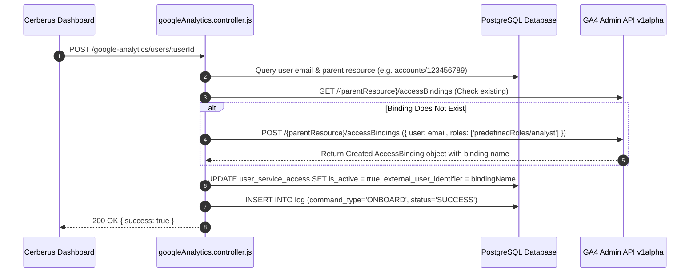
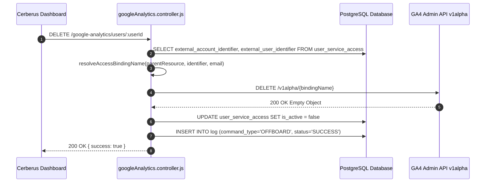

# Google Analytics Integration — Technical Documentation

## 1. Integration Overview
Cerberus manages user access bindings for **Google Analytics 4 (GA4)** via the **Google Analytics Admin API v1alpha**. The integration supports granting and revoking account-level (`accounts/123456789`) or property-level (`properties/123456789`) access bindings.

---

## 2. Relevant Cerberus Code

| File | Purpose | Important Functions |
| --- | --- | --- |
| `backend/src/controllers/googleAnalytics.controller.js` | Main controller for GA4 Admin API access bindings | `addGoogleAnalyticsUser`, `removeGoogleAnalyticsUser`, `listGoogleAnalyticsAccessBindings`, `getGoogleAnalyticsClient` |
| `backend/src/routes/googleAnalytics.routes.js` | Express router mounting GA4 endpoints | Router endpoints for `/google-analytics/users/:userId` |
| `frontend/src/App.js` | Frontend orchestrator handling GA4 API calls | `onboardAccesses`, `offboardAccesses` |

---

## 3. Authentication / Credentials

### Credential Lifecycle
`googleanalytics_json/*.json (Service Account)` → `getGoogleAnalyticsClient()` → `new GoogleAuth({ keyFile, scopes: ["https://www.googleapis.com/auth/analytics.manage.users"] })` → `auth.getClient()`

- Key file stored in `backend/googleanalytics_json/`.
- Authenticates with scope `https://www.googleapis.com/auth/analytics.manage.users`.

---

## 4. Required Provider-Side Setup

1. **Enable Google Analytics Admin API** in Google Cloud Console.
2. **Add Service Account as Administrator** in Google Analytics Account or Property Access Management settings.

---

## 5. Onboarding — Complete Flow



---

## 6. Offboarding — Complete Flow



---

## 7. External API Calls

| Cerberus Function | External API Endpoint | HTTP Method | Purpose | Required Data |
| --- | --- | --- | --- | --- |
| `listAccessBindings` | `/v1alpha/{parentResource}/accessBindings` | `GET` | Paginate access bindings list | `pageSize=200`, `pageToken` |
| `createAccessBinding` | `/v1alpha/{parentResource}/accessBindings` | `POST` | Add user binding | `data: { user: email, roles: [role] }` |
| `deleteAccessBinding` | `/v1alpha/{bindingName}` | `DELETE` | Delete access binding | `bindingName` in URL |

---

## 8. Request and Response Examples

### Create Access Binding Request Payload
```json
{
  "user": "analyst@example.com",
  "roles": [
    "predefinedRoles/analyst"
  ]
}
```

---

## 9. Roles and Permissions
- **Default Role Assigned:** `predefinedRoles/analyst` (Google Analytics Analyst predefined role).
- **Other Supported Roles:** `predefinedRoles/viewer`, `predefinedRoles/editor`, `predefinedRoles/admin`.

---

## 10. Important IDs and Configuration

- `external_account_identifier`: Parent resource identifier (formatted as `accounts/123456789` or `properties/987654321`).
- `external_user_identifier`: Stores resolved binding name (e.g. `accounts/123456789/accessBindings/1029384756`).

---

## 11. Error Handling

- **Invalid Parent Resource Format:** Validates format matching `/^(accounts|properties)\/[^/]+$/`; throws HTTP 400 if invalid.
- **Binding Resolution Error:** Searches active bindings list by email if exact binding name is not stored in DB.

---

## 12. Security Considerations

- Service account key in `googleanalytics_json/` must strictly hold user management permissions in GA4 console.

---

## 13. Edge Cases

- Supports lookup by either direct binding name ID (`accounts/123/accessBindings/456`) or user email string.

---

## 14. Testing the Integration

- List active bindings: `GET /google-analytics/access-bindings?parent=accounts/YOUR_ACCOUNT_ID`.

---

## 15. Troubleshooting

- **Error `403 Permission Denied`:** Ensure the service account has Administrator role in GA4 Account Access Management.

---

## 16. Current Limitations

- Fine-grained data restrictions (e.g. cost data restriction filters) require manual configuration in GA4.

---

## 17. How to Modify or Extend the Integration

- Modify `targetRole = role_name || "predefinedRoles/analyst"` in `googleAnalytics.controller.js` line 295 to assign different roles.

---

## 18. End-to-End Summary Flow

```text
Administrator -> Cerberus Dashboard -> POST /google-analytics/users/:userId -> googleAnalytics.controller.js -> GA4 Admin API -> Access Binding Created -> Database Updated
```
