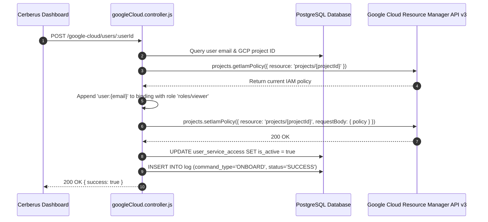
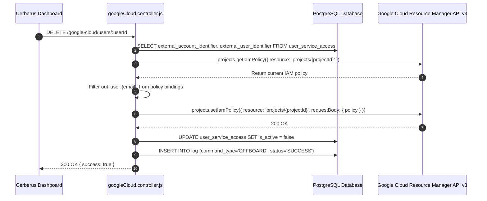

# Google Cloud IAM Integration — Technical Documentation

## 1. Integration Overview
Cerberus manages project-level IAM roles on **Google Cloud Platform (GCP)** using the **Google Cloud Resource Manager API v3**. Provisioning appends target IAM roles to GCP projects, while offboarding filters out user IAM bindings during offboarding.

---

## 2. Relevant Cerberus Code

| File | Purpose | Important Functions |
| --- | --- | --- |
| `backend/src/controllers/googleCloud.controller.js` | Main controller for Google Cloud IAM policy management | `onboardGoogleCloudUser`, `removeGoogleCloudUser`, `getCloudResourceManagerClient`, `getGoogleCloudProjectId` |
| `backend/src/routes/googleCloud.routes.js` | Express router mounting Google Cloud endpoints | Router endpoints for `/google-cloud/users/:userId` |
| `frontend/src/App.js` | Frontend orchestrator handling Google Cloud API requests | `onboardAccesses`, `offboardAccesses` |

---

## 3. Authentication / Credentials

### Credential Lifecycle
`googlecloud_json/*.json (Service Account)` → `getCloudResourceManagerClient()` → `google.auth.GoogleAuth({ keyFile, scopes: ["https://www.googleapis.com/auth/cloud-platform"] })` → `google.cloudresourcemanager({ version: "v3", auth })`

- Service account JSON key stored in `backend/googlecloud_json/`.

---

## 4. Required Provider-Side Setup

1. **Enable Google Cloud Resource Manager API** in Google Cloud.
2. **Grant Project IAM Admin Role (`roles/resourcemanager.projectIamAdmin`)** to the service account on target GCP projects.

---

## 5. Onboarding — Complete Flow



---

## 6. Offboarding — Complete Flow



---

## 7. External API Calls

| Cerberus Function | External SDK Method | Purpose | Required Data |
| --- | --- | --- | --- |
| `onboardGoogleCloudUser` | `crm.projects.getIamPolicy` & `setIamPolicy` | Read & append IAM role | `resource: projects/{projectId}` |
| `removeGoogleCloudUser` | `crm.projects.getIamPolicy` & `setIamPolicy` | Read & remove IAM role | `resource: projects/{projectId}` |

---

## 8. Request and Response Examples

### Updated IAM Policy Body
```json
{
  "policy": {
    "bindings": [
      {
        "role": "roles/viewer",
        "members": [
          "user:developer@example.com"
        ]
      }
    ]
  }
}
```

---

## 9. Roles and Permissions
- **Default Onboard Role:** `roles/viewer`.
- **Custom Roles:** Supported if specified in `user_service_access.role_name` (e.g. `roles/editor`, `roles/browser`).

---

## 10. Important IDs and Configuration

- `external_account_identifier`: GCP Project ID (e.g. `easleydunn-prod-123`).
- `external_user_identifier`: User email address.

---

## 11. Error Handling

- **User/Role Combo Not Found:** Returns 404 if user does not exist in policy during offboarding.
- **Missing Credentials:** Returns 500 if key file is missing in `googlecloud_json/`.

---

## 12. Security Considerations

- Read-modify-write pattern on IAM policy preserves existing organization bindings.

---

## 13. Edge Cases

- Handles empty initial `policy.bindings` array safely without throwing `undefined` reference errors.

---

## 14. Testing the Integration

- Trigger `POST /google-cloud/users/:userId` against test project ID.

---

## 15. Troubleshooting

- **Error 403 `IAM permission denied`:** Ensure service account possesses `roles/resourcemanager.projectIamAdmin`.

---

## 16. Current Limitations

- Project-level IAM bindings are managed; folder or organization-level IAM inherits downstream.

---

## 17. How to Modify or Extend the Integration

- Edit `targetRole = role_name || "roles/viewer"` in `googleCloud.controller.js` line 296 to assign custom default roles.

---

## 18. End-to-End Summary Flow

```text
Administrator -> Cerberus Dashboard -> POST /google-cloud/users/:userId -> googleCloud.controller.js -> GCP Resource Manager API -> IAM Policy Updated -> Log Saved
```
