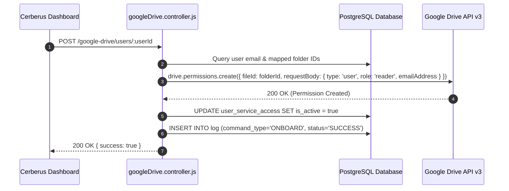
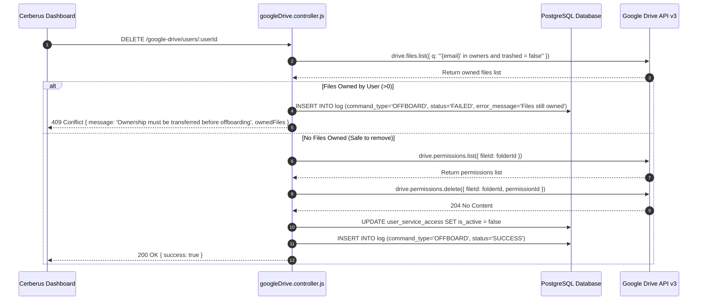

# Google Drive Integration — Technical Documentation

## 1. Integration Overview
Cerberus manages shared folder access on **Google Drive** using the **Google Drive API v3**. Provisioning grants reader/writer permissions on mapped Drive folders. Crucially, offboarding incorporates an **ownership audit check**: if the target user still owns files inside Google Drive, offboarding is blocked until file ownership is transferred.

---

## 2. Relevant Cerberus Code

| File | Purpose | Important Functions |
| --- | --- | --- |
| `backend/src/controllers/googleDrive.controller.js` | Main controller for Google Drive permissions & ownership auditing | `onboardGoogleDriveUser`, `offboardGoogleDriveUser`, `auditGoogleDriveOwnership`, `getDriveClient` |
| `backend/src/routes/googleDrive.routes.js` | Express router for Drive endpoints | Router endpoints for `/google-drive/users/:userId` & audit |
| `frontend/src/App.js` | Frontend orchestrator handling Drive API requests | `onboardAccesses`, `offboardAccesses` |

---

## 3. Authentication / Credentials

### Credential Lifecycle
`googledrive_json/*.json (Service Account)` → `getDriveClient()` → `google.auth.GoogleAuth({ keyFile, scopes: ["https://www.googleapis.com/auth/drive"] })` → `google.drive({ version: "v3", auth })`

- Service account key stored in `backend/googledrive_json/`.
- Authenticates with full Drive scope `https://www.googleapis.com/auth/drive`.

---

## 4. Required Provider-Side Setup

1. **Enable Google Drive API** in Google Cloud Console.
2. **Share Target Drive Folders** with the Service Account email address as an Editor/Organizer.

---

## 5. Onboarding — Complete Flow



---

## 6. Offboarding — Complete Flow (With Ownership Guardrail)



---

## 7. External API Calls

| Cerberus Function | External SDK Method | Purpose | Required Data |
| --- | --- | --- | --- |
| `onboardGoogleDriveUser` | `drive.permissions.create` | Grant folder permission | `fileId`, `requestBody: { type: 'user', role, emailAddress }` |
| `auditOwnedFiles` | `drive.files.list` | Check for user-owned files | `q: "'{email}' in owners and trashed = false"` |
| `offboardGoogleDriveUser` | `drive.permissions.list` & `delete` | Locate & delete user permission ID | `fileId`, `permissionId` |

---

## 8. Request and Response Examples

### Ownership Audit Block Response (HTTP 409 Conflict)
```json
{
  "success": false,
  "message": "Cannot offboard user. 2 file(s) are still owned by user@example.com. Ownership must be transferred before removal.",
  "ownedFiles": [
    {
      "id": "1A2B3C4D5E",
      "name": "Q3 Financial Report.docx",
      "mimeType": "application/vnd.google-apps.document",
      "webViewLink": "https://docs.google.com/document/d/1A2B3C4D5E/edit"
    }
  ]
}
```

---

## 9. Roles and Permissions
- **Folder Permissions Assigned:** `reader` (default) or `writer` (if specified in `role_name`).
- **Service Account Requirement:** Must be shared on parent Google Drive folders.

---

## 10. Important IDs and Configuration

- `external_account_identifier`: Google Drive Folder ID (e.g. `1PngrPL6m3lGTWCyge2cOhZuMqcYLi7ve`).
- `external_user_identifier`: User email address.

---

## 11. Error Handling

- **Ownership Audit Failure (409 Conflict):** Blocks offboarding if target user owns active files.
- **Permission Already Missing:** Handles `not_found` gracefully if user was manually unshared.

---

## 12. Security Considerations

- The ownership audit guardrail prevents data loss and orphan file scenarios when employee accounts are deleted from Google Workspace.

---

## 13. Edge Cases

- If no specific folder ID is stored in DB during onboarding, a default fallback folder ID is used.

---

## 14. Testing the Integration

- Run audit check endpoint: `GET /google-drive/users/:userId/audit`.

---

## 15. Troubleshooting

- **Error `File not found` during permission creation:** Ensure the service account has Editor access to the target Drive Folder ID.

---

## 16. Current Limitations

- Automatic ownership transfer is not executed automatically; admins must manually reassign file ownership in Google Drive UI before offboarding can complete.

---

## 17. How to Modify or Extend the Integration

- To customize default folder permissions, update line 127 in `googleDrive.controller.js`.

---

## 18. End-to-End Summary Flow

```text
Administrator -> Cerberus Dashboard -> DELETE /google-drive/users/:userId -> Drive Ownership Audit -> Revoke Permissions -> Log Execution
```
