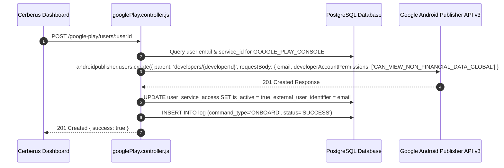
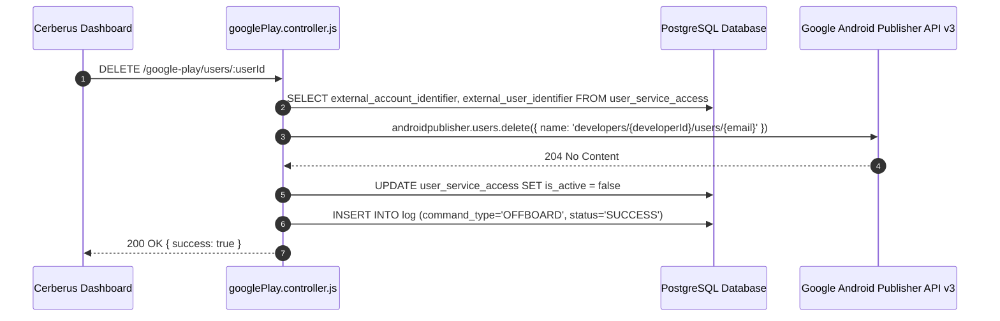

# Google Play Console Integration — Technical Documentation

## 1. Integration Overview
Cerberus integrates with **Google Play Developer Console** via the **Google Android Publisher API v3**. The integration automates team access management for Android app publishing by adding users to developer accounts during onboarding and deleting user access during offboarding.

---

## 2. Relevant Cerberus Code

| File | Purpose | Important Functions |
| --- | --- | --- |
| `backend/src/controllers/googlePlay.controller.js` | Main controller for Google Play API interactions | `onboardGooglePlayUser`, `removeGooglePlayUser`, `listGooglePlayUsers`, `getGooglePlayClient` |
| `backend/src/routes/googlePlay.routes.js` | Express router mounting Google Play endpoints | Router endpoints for `/google-play/users/:userId` |
| `frontend/src/App.js` | Frontend orchestrator handling Google Play onboarding/offboarding API requests | `onboardAccesses`, `offboardAccesses` |

---

## 3. Authentication / Credentials

### Credential Lifecycle
`googleplay_json/*.json (Service Account)` → `getGooglePlayClient()` → `google.auth.GoogleAuth({ keyFile, scopes: ["https://www.googleapis.com/auth/androidpublisher"] })` → `google.androidpublisher({ version: "v3", auth })`

1. The service account JSON key file is stored inside `backend/googleplay_json/`.
2. `getGooglePlayClient()` dynamically scans `googleplay_json/` for a `.json` key file.
3. Authenticates with scope `https://www.googleapis.com/auth/androidpublisher`.

---

## 4. Required Provider-Side Setup

1. **Enable Google Play Developer API** in Google Cloud Console.
2. **Link Google Cloud Project** to the Google Play Developer Account.
3. **Grant Service Account Admin Access** in Google Play Console under Users & Permissions.
4. **Environment Variable:** `GOOGLE_PLAY_DEVELOPERID` configured in `backend/.env`.

---

## 5. Onboarding — Complete Flow



---

## 6. Offboarding — Complete Flow



---

## 7. External API Calls

| Cerberus Function | External SDK Method | HTTP Method | Purpose | Required Data |
| --- | --- | --- | --- | --- |
| `onboardGooglePlayUser` | `androidpublisher.users.create` | `POST` | Invite user to Developer Account | `parent`, `requestBody: { email, developerAccountPermissions }` |
| `removeGooglePlayUser` | `androidpublisher.users.delete` | `DELETE` | Remove user from Developer Account | `name: developers/{developerId}/users/{email}` |
| `listGooglePlayUsers` | `androidpublisher.users.list` | `GET` | List users under Developer Account | `parent: developers/{developerId}`, `pageSize: -1` |

---

## 8. Request and Response Examples

### Onboard User Request Payload (to Google API)
```json
{
  "email": "user@example.com",
  "developerAccountPermissions": [
    "CAN_VIEW_NON_FINANCIAL_DATA_GLOBAL"
  ]
}
```

### Onboard User Response (from Google API)
```json
{
  "name": "developers/1234567890/users/user@example.com",
  "email": "user@example.com",
  "developerAccountPermissions": [
    "CAN_VIEW_NON_FINANCIAL_DATA_GLOBAL"
  ]
}
```

---

## 9. Roles and Permissions
- **Default Assigned Role:** `CAN_VIEW_NON_FINANCIAL_DATA_GLOBAL` (Minimum permissions required to grant user visibility).
- **Service Account Permissions Required:** Admin user management permission in Google Play Developer Console.

---

## 10. Important IDs and Configuration

- `developerId`: Extracted from environment variable `GOOGLE_PLAY_DEVELOPERID`.
- `external_account_identifier`: Stores `developerId`.
- `external_user_identifier`: Stores user email address.

---

## 11. Error Handling

- **Missing Key File:** Throws `No .json credentials file found inside the googleplay_json folder.` (HTTP 500).
- **User Not Found in DB:** Returns HTTP 404.
- **API Errors:** Trapped in `catch (error)`, logs exact error message into `log.error_message`, and returns HTTP 500.

---

## 12. Security Considerations

- Service account key is stored on disk inside gitignored folder `backend/googleplay_json/`.
- Private keys are never returned over API endpoints.

---

## 13. Edge Cases

- **Already Onboarded:** If `user_service_access` record exists, updates record to `is_active = true`.
- **Pagination Limit:** `androidpublisher.users.list` requires `pageSize: -1` as Google Play API disables traditional pagination.

---

## 14. Testing the Integration

- Test endpoint: `GET /google-play/developers/:developerId/users`.
- Run manual test using postman or curl with valid service account JSON placed in `backend/googleplay_json/`.

---

## 15. Troubleshooting

- **Error `403 Permission Denied`:** Ensure the service account email is added as an Admin user in Google Play Developer Console.
- **Error `GOOGLE_PLAY_DEVELOPERID not configured`:** Check `.env` file for `GOOGLE_PLAY_DEVELOPERID`.

---

## 16. Current Limitations

- Role selection is fixed to `CAN_VIEW_NON_FINANCIAL_DATA_GLOBAL` during automated onboarding; fine-grained app-level permissions require manual console adjustments.

---

## 17. How to Modify or Extend the Integration

- To change assigned roles, edit lines 201-205 in `backend/src/controllers/googlePlay.controller.js`.

---

## 18. End-to-End Summary Flow

```text
Administrator -> Cerberus Dashboard -> POST /google-play/users/:userId -> googlePlay.controller.js -> Google Android Publisher API -> User Added to Google Play -> Log Inserted into PostgreSQL
```
