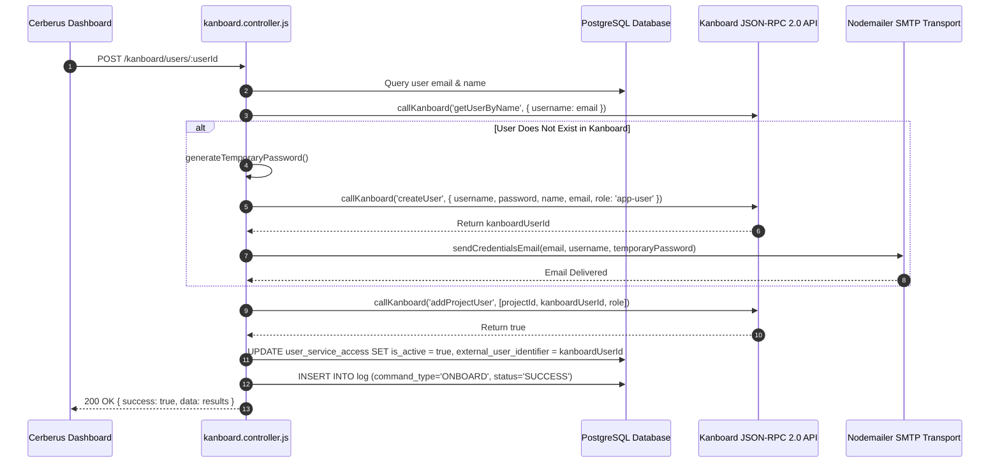
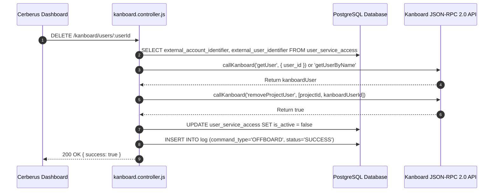

# Kanboard Integration — Technical Documentation

## 1. Integration Overview
Cerberus integrates with **Kanboard** project management via the **Kanboard JSON-RPC 2.0 API** and **Nodemailer SMTP**. During onboarding, Cerberus creates a Kanboard user account, assigns the user to a default or specified project (`addProjectUser`), generates a secure temporary password, and emails login credentials to the user. Offboarding revokes project access (`removeProjectUser`).

---

## 2. Relevant Cerberus Code

| File | Purpose | Important Functions |
| --- | --- | --- |
| `backend/src/controllers/kanboard.controller.js` | Main controller for Kanboard JSON-RPC 2.0 API & credentials mailing | `onboardKanboardUser`, `offboardKanboardUser`, `callKanboard`, `createKanboardUser`, `grantKanboardProjectAccess`, `revokeKanboardProjectAccess`, `sendCredentialsEmail` |
| `backend/src/routes/kanboard.routes.js` | Express router mounting Kanboard endpoints | Router endpoints for `/kanboard/users/:userId` |
| `frontend/src/App.js` | Frontend orchestrator handling Kanboard API calls | `onboardAccesses`, `offboardAccesses` |

---

## 3. Authentication / Credentials

### Credential Lifecycle
`KANBOARD_API_USERNAME` + `KANBOARD_API_TOKEN` → `callKanboard()` → `Authorization: Basic base64(username:token)` → HTTP POST to `KANBOARD_API_URL`

- **Kanboard JSON-RPC API Auth:** Basic Auth header.
- **SMTP Mail Auth:** `nodemailer.createTransport({ host, port, auth: { user, pass } })`.

---

## 4. Required Provider-Side Setup

1. **Enable API** in Kanboard Settings → API.
2. Configure environment variables in `backend/.env`:
   - `KANBOARD_API_URL`: e.g. `https://kanboard.example.com/jsonrpc.php`.
   - `KANBOARD_API_USERNAME`: `jsonrpc`.
   - `KANBOARD_API_TOKEN`: Kanboard API token.
   - `KANBOARD_URL`: Web portal login URL.
   - `MAIL_SMTP_HOSTNAME`, `MAIL_SMTP_PORT`, `MAIL_SMTP_USERNAME`, `MAIL_SMTP_PASSWORD`, `MAIL_FROM`.

---

## 5. Onboarding — Complete Flow



---

## 6. Offboarding — Complete Flow



---

## 7. External API Calls

| Cerberus Function | JSON-RPC Method | Purpose | Parameters |
| --- | --- | --- | --- |
| `findKanboardUser` | `getUserByName` / `getUser` / `getAllUsers` | Find user in Kanboard | `{ username }` or `{ user_id }` |
| `createKanboardUser` | `createUser` | Create new Kanboard user | `{ username, password, name, email, role: 'app-user' }` |
| `grantKanboardProjectAccess` | `addProjectUser` | Grant project membership | `[projectId, kanboardUserId, role]` |
| `revokeKanboardProjectAccess` | `removeProjectUser` | Revoke project membership | `[projectId, kanboardUserId]` |

---

## 8. Request and Response Examples

### Kanboard JSON-RPC Request Example
```json
{
  "jsonrpc": "2.0",
  "method": "addProjectUser",
  "id": 1723456789,
  "params": [1, 42, "project-member"]
}
```

---

## 9. Roles and Permissions
- **System Role Assigned:** `app-user` (Standard user).
- **Project Role Assigned:** `project-member` (default) or `project-viewer`.

---

## 10. Important IDs and Configuration

- `external_account_identifier`: Kanboard Project ID (e.g. `1`).
- `external_user_identifier`: Kanboard numeric User ID (e.g. `42`).

---

## 11. Error Handling

- **JSON-RPC Error Handling:** Inspects `body.error` and `body.result === false`; throws descriptive JavaScript errors caught by `asyncHandler`.

---

## 12. Security Considerations

- Temporary passwords generated via `crypto.randomBytes(18).toString("base64url")`.
- Credentials sent over TLS SMTP.

---

## 13. Edge Cases

- **User Already Exists:** If Kanboard user exists, skips account creation and proceeds directly to `grantKanboardProjectAccess`.

---

## 14. Testing the Integration

- Run `POST /kanboard/users/:userId` with configured Kanboard API env variables.

---

## 15. Troubleshooting

- **Error `Invalid Kanboard API response`:** Check `KANBOARD_API_URL` to ensure it points directly to `/jsonrpc.php`.

---

## 16. Current Limitations

- Offboarding revokes project membership (`removeProjectUser`); to permanently disable the Kanboard user account, `disableUser` RPC method can be added.

---

## 17. How to Modify or Extend the Integration

- Edit default role in `.env` via `KANBOARD_DEFAULT_ROLE=project-viewer`.

---

## 18. End-to-End Summary Flow

```text
Administrator -> Cerberus Dashboard -> POST /kanboard/users/:userId -> kanboard.controller.js -> JSON-RPC API -> Project Member Added -> Credentials Emailed -> Database Updated
```
